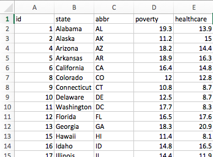

# Unit 16 | Assignment - Data Journalism and D3

<a target='_blank' href="https://giphy.com/gifs/newspaper-press-v2xIous7mnEYg">  <em>via GIPHY</em></a>

### Level 1: D3 Dabbler

Find a correlation between two data variables, each measured state by state and taken from different data sources. Then visualize the correlation with a scatter plot and embed the graphic into an .html file.

#### 1. Find the Data

Look pu the data through [American FactFinder](http://factfinder.census.gov/faces/nav/jsf/pages/searchresults.xhtml) tool and Behavioral Risk Factor Surveillance System](https://chronicdata.cdc.gov/Behavioral-Risk-Factors/BRFSS-2014-Overall/5ra3-ixqq).
Then set the filter.

#### 2. Format and Test the Data

Format data for D3. With data types chosen, grab the value columns from each and paste them into a new Excel document. Create header names that you can easily call with JavaScript.

To make sure you have a solid trend, you need to test for correlation with Excel's `=CORREL()` function. Aim for a value either less than -0.5 or more than 0.5—these values would indicate a moderate correlation and a story that might be worth pursuing (shoot for -0.75 or 0.75 if you're feeling super diligent).

#### 3. Visualize the Data

Using the D3 techniques, create a scatter plot that represents each state with circle elements. Using the `d3.csv` function. The plot should ultimately appear like the image at the top of this section.

* The x-values of the circles should match the demographic census data, while the y-values should represent the risk data.

* Include state abbreviations in the circles.

* Create and situate axes and labels to the left and bottom of the chart.

* Generate this chart in the `d3.html` file in assignment directory.

#### 4. Embed into an iframe

When `d3.html` displays the graphic, embed it in `index.html` with an iframe. 
- - -
#### step 2

#### 1. More Data, More Dynamics

Include two more demographics and two more risks. Place additional labels in your scatter plot and give them click events so that users can decide which data to display. Animate the transitions for your circles' locations as well as the range of your axes.

#### 2. Incorporate d3-tip

While the ticks on the axes allow us to infer approximate values for each circle, it's impossible to determine the true value without adding another layer of data. Enter tooltips: developers can implement these in their D3 graphics to reveal a specific element's data when the user hovers their cursor over the element. Add tooltips to your circles and display each tooltip with the data that the user has selected. Use the `d3-tip.js` plugin developed by [Justin Palmer](https://github.com/Caged)—we've already included this plugin in your assignment directory.

- - -

### Level 3

Add a function to scatter plot that changes the look of svg whenever the size of your window/iframe changes. D3 lacks a one-size-fits-all approach to mobile since every graph will look different depending on the topic and developer. You'll need to decide what attributes to morph for whenever the screen size changes. Make sure that the graph is visible in the `index.html` iframe.

- - -

## Copyright

Coding Boot Camp (C) 2016. All Rights Reserved.
